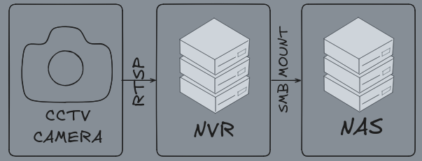

# LiteNVR

LiteNVR is a minimal, self-healing NVR system engineered to capture raw RTSP camera streams via FFmpeg and write them directly to a remote network-attached storage (NAS) share. It runs as a lightweight, persistent systemd daemon with zero local storage overhead and a built-in safety loop for network outages.



*IMAGE: High-Level Diagram.*

## Architecture Overview

* **Stateless Compute:** Host machine ingests stream and handles segmentation without logging persistent data locally.
* **Decoupled Storage:** CCTV footage is streamed directly to a remote SMB/CIFS NAS.
* **Outage Resilient:** Built-in checks prevent local disk storage exhaustion if the network drops or the NAS freezes.

## Requirements

* **OS:** Debian/Ubuntu-based Linux distribution (systemd required).
* **Network:** Active SMB/CIFS network share.
* **Hardware:** IP camera with accessible RTSP stream.

## Installation & Setup

### 1. Clone the Repository

Use `git` to clone the repo. 

```
git clone https://github.com/glob-bruh/LiteNVR
cd LiteNVR
```

### 2. Configure Your Environment

Edit the configuration template and populate it with your infrastructure details:

```
nano .cctv_configuration.env
```

Ensure the values match your network architecture.

### 3. Run the Installer

Execute the automated installation script with `root`. This will install dependencies, provision the environment, configure fstab mount points, and start services:

```
sudo chmod +x installer.sh
sudo ./installer.sh
```

### 4. Configure Automated Retention

To keep local storage from filling up indefinitely, remember to configure a cron job to prune files older than 3 days.

## Verifying the Deployment

You can monitor the active state of your stream or troubleshoot issues using standard systemd tools:

### Check service status

```
sudo systemctl status cctv.service
```

### View live rolling recording logs

```
sudo journalctl -u cctv.service -f
```